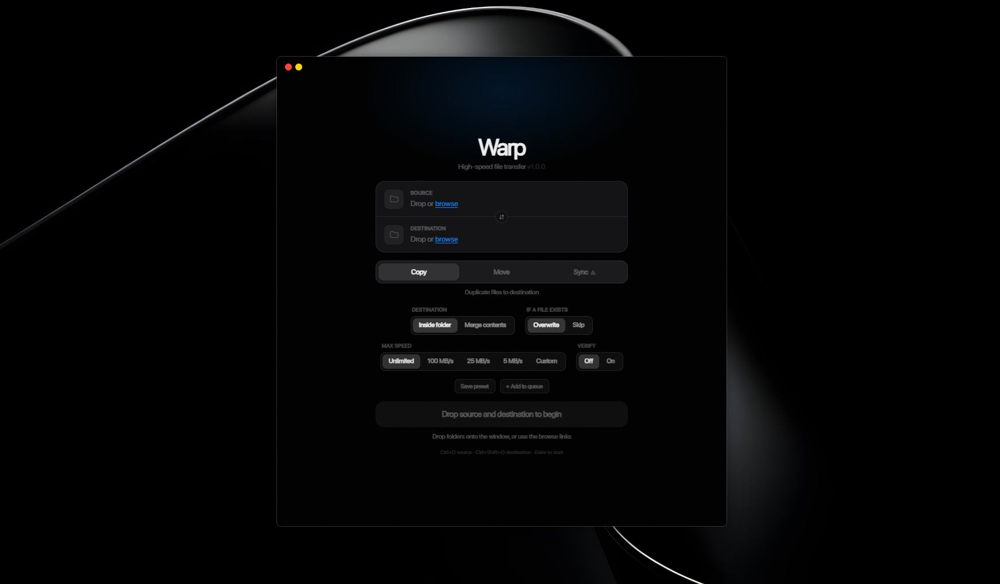

# Warp — High-Speed File Transfer

> A fast, minimal desktop app for copying, moving, and syncing files on Windows.

Warp wraps Windows' built-in `robocopy` in a clean, modern interface — giving you real-time progress, live transfer speed, and per-transfer summaries without touching the command line.

---

## Screenshots

> Drop a source folder, drop a destination, pick a mode, hit go.



---

## Features

| Feature | Details |
|---|---|
| **3 transfer modes** | Copy, Move, Sync |
| **Drag & drop** | Drop folders directly onto the window |
| **Browse button** | Native folder picker dialog |
| **Real overall progress** | Accurate 0–100% based on total bytes, not per-file |
| **Live speed** | Calculated from bytes per second in real time |
| **Cancel anytime** | Stops robocopy immediately, no orphan processes |
| **Folder mode** | "Inside folder" or "Merge contents" |
| **Conflict resolution** | Overwrite existing or skip |
| **Swap paths** | One click to flip source ↔ destination |
| **Sync warning** | Confirmation modal before any destructive mirror |
| **Merge + Sync warning** | Extra warning for the dangerous combination |
| **Cross-drive move warning** | Warns when moving across different drives |
| **OneDrive / network detection** | Orange warning on slow paths |
| **File drop detection** | Rejects files, only accepts folders |
| **Long path support** | Handles paths longer than 260 characters |
| **Empty folder support** | Indeterminate progress bar for zero-byte transfers |
| **Error surfacing** | Disk full, access denied, path errors shown clearly |
| **Recent transfers** | Quick access to last 5 jobs (persisted across restarts) |
| **System notifications** | Notified when a background transfer finishes |
| **Keyboard shortcuts** | Enter, Esc, Ctrl+O, Ctrl+Shift+O |
| **Sub-second duration** | Shows `0.3s` instead of `0s` |
| **Version display** | App version shown in the UI |
| **Resizable window** | Drag to resize up to 700×900 |

---

## Download

Download the latest installer from the [Releases](../../releases) page:

```
Warp_1.0.0_x64-setup.exe    Windows installer (recommended)
Warp_1.0.0_x64_en-US.msi   MSI installer
```

**Requirements:** Windows 10 or 11 (64-bit). That's it — no additional installs needed. Robocopy is built into Windows.

---

## Usage

### Basic transfer

1. **Drop** a source folder onto the left zone (or click **browse**)
2. **Drop** a destination folder onto the right zone (or click **browse**)
3. Choose a **mode** — Copy, Move, or Sync
4. Choose **destination behavior** — Inside folder or Merge contents
5. Click **Copy / Move / Sync Files** or press **Enter**

### Transfer modes

| Mode | What it does |
|---|---|
| **Copy** | Duplicates files to the destination. Source is untouched. |
| **Move** | Transfers files and removes the source folder completely. |
| **Sync** | Makes destination an exact mirror of source. ⚠ Files only in destination are deleted. |

### Destination behavior

| Option | Result |
|---|---|
| **Inside folder** | `source=Photos, dest=Backup` → files land in `Backup\Photos\` |
| **Merge contents** | `source=Photos, dest=Backup` → files land directly in `Backup\` |

### Keyboard shortcuts

| Key | Action |
|---|---|
| `Enter` | Start transfer (when both paths are set) |
| `Esc` | Cancel transfer / reset / close modal |
| `Ctrl+O` | Browse for source folder |
| `Ctrl+Shift+O` | Browse for destination folder |

---

## Building from Source

### Prerequisites

| Tool | Notes |
|---|---|
| [Node.js 18+](https://nodejs.org) | JavaScript runtime |
| [Rust (MSVC toolchain)](https://rustup.rs) | `rustup default stable-x86_64-pc-windows-msvc` |
| [VS 2022 Build Tools](https://visualstudio.microsoft.com/downloads/#build-tools-for-visual-studio-2022) | C++ workload required |
| Windows SDK | Installed automatically with Build Tools |

**Install Build Tools via winget:**
```cmd
winget install Microsoft.VisualStudio.2022.BuildTools --override "--add Microsoft.VisualStudio.Workload.VCTools --includeRecommended"
```

### Clone and build

```bash
git clone https://github.com/your-username/warp
cd warp
npm install
node scripts/build.js
```

Output installer:
```
src-tauri/target/release/bundle/nsis/Warp_1.0.0_x64-setup.exe
```

### Development (hot reload)

```bash
# Terminal 1 — start Vite dev server
npm run dev

# Terminal 2 — start Tauri with hot reload
npm run tauri dev
```

Frontend (`.svelte`) changes appear instantly. Rust changes require a rebuild.

---

## Tech Stack

| Layer | Technology | Why |
|---|---|---|
| Desktop shell | [Tauri 2](https://tauri.app) | Tiny binary (~5 MB), native Rust backend |
| Frontend | [SvelteKit 2](https://kit.svelte.dev) + Svelte 5 | Compiler-based, no virtual DOM |
| Styling | [Tailwind CSS v4](https://tailwindcss.com) | Zero-config, minimal output |
| Language | TypeScript + Rust (2021 edition) | Type safety on both sides |
| File transfer engine | `robocopy` (Windows built-in) | Multi-threaded, resumable, battle-tested |

### Why not Electron?

Electron bundles a full Chromium engine (~150 MB). Warp's installer is under 10 MB. Rust handles all file system operations natively with zero overhead.

### Why robocopy?

Robocopy ships with every Windows installation since Vista. It supports multi-threaded transfers (`/MT:32`), long paths (`/256`), restartable mode, and has been production-hardened for 20+ years. No reinventing the wheel.

---

## Architecture

```
warp/
├── src/                        # SvelteKit frontend
│   ├── routes/+page.svelte     # Main UI (all in one component)
│   └── app.css                 # Global styles + CSS variables
├── src-tauri/                  # Rust backend
│   ├── src/lib.rs              # Tauri commands, robocopy wrapper, parser
│   ├── src/main.rs             # Entry point
│   ├── Cargo.toml              # Rust dependencies
│   ├── tauri.conf.json         # App config (window, bundle, permissions)
│   └── capabilities/           # Tauri permission system
├── scripts/
│   └── build.js                # Cross-platform build script (auto-finds vcvars64)
└── README.md
```

### How progress works

1. **Scan pass** — `robocopy /L` does a dry-run and counts total bytes
2. **Transfer pass** — actual robocopy runs with `/BYTES /NP /MT:32`
3. Each `New File` line in robocopy's output = one file completed
4. Overall `%` = `bytes_done / total_bytes`
5. Speed = bytes transferred in the last 400ms window

### How cancel works

The robocopy child process handle is stored in `Mutex<Option<Child>>` in Tauri's app state. Calling `cancel_warp` kills the process via `child.kill()` and waits for it to exit cleanly.

---

## Known Limitations

- **Windows only** — uses `robocopy` which is Windows-specific. macOS/Linux would need `rsync`.
- **No admin elevation** — copying to protected directories (Program Files, System32) will fail with access denied.
- **OneDrive virtual files** — files not yet downloaded locally will transfer as 0-byte placeholders.
- **No transfer queue** — one transfer at a time.

---

## License

MIT — do whatever you want with it.

---

## Acknowledgements

Built with [Tauri](https://tauri.app), [Svelte](https://svelte.dev), and [Tailwind CSS](https://tailwindcss.com).
