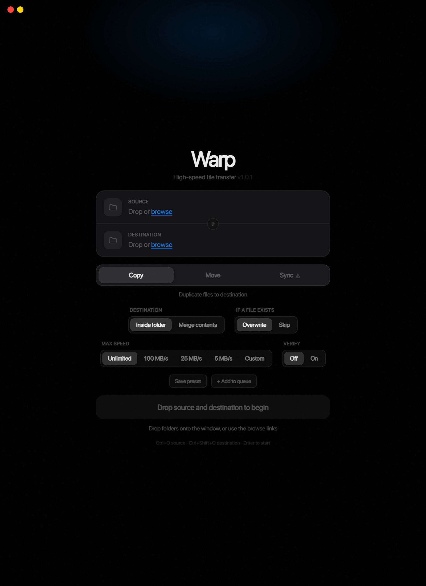

<div align="center">


# Warp — High-Speed File Transfer

**A fast, minimal desktop app for copying, moving, and syncing files on Windows.**

Warp wraps Windows' built-in `robocopy` in a clean, modern interface — giving you real-time progress, live transfer speed, and per-transfer summaries without touching the command line.

[](https://tauri.app)
[](https://kit.svelte.dev)
[](https://www.typescriptlang.org)
[](https://www.rust-lang.org)
[](https://github.com/alvindemesadev/warp/releases)
[](#license)



</div>

---

## Features

| Feature | Details |
|---|---|
| **3 transfer modes** | Copy, Move, Sync |
| **Drag & drop** | Drop folders directly onto the window |
| **Browse button** | Native folder picker dialog |
| **Real overall progress** | Accurate 0–100% based on total bytes, not per-file |
| **Live speed** | Calculated from bytes per second in real time |
| **Cancel anytime** | Stops robocopy immediately, no orphan processes |
| **Folder mode** | "Inside folder" or "Merge contents" |
| **Conflict resolution** | Overwrite existing or skip |
| **Swap paths** | One click to flip source ↔ destination |
| **Sync warning** | Confirmation modal before any destructive mirror |
| **Merge + Sync warning** | Extra warning for the dangerous combination |
| **Cross-drive move warning** | Warns when moving across different drives |
| **OneDrive / network detection** | Orange warning on slow paths |
| **File drop detection** | Rejects files, only accepts folders |
| **Long path support** | Handles paths longer than 260 characters |
| **Empty folder support** | Indeterminate progress bar for zero-byte transfers |
| **Error surfacing** | Disk full, access denied, path errors shown clearly |
| **Recent transfers** | Quick access to last 5 jobs (persisted across restarts) |
| **Transfer queue** | Stack multiple jobs and run them back-to-back |
| **Presets** | Save a source/destination/options combo and reload it in one click |
| **Live file list** | See files scroll by as they transfer, not just the current one |
| **ETA** | Estimated time remaining, from live throughput |
| **Verify mode** | Optional post-transfer re-compare to confirm every file arrived |
| **Bandwidth throttle** | Cap transfer speed (Unlimited / 100 / 25 / 5 MB/s, or a custom value) to leave headroom |
| **System notifications** | Notified when a background transfer finishes |
| **In-app updates** | "Check for updates" — signature-verified installs straight from GitHub Releases, no re-downloading |
| **Keyboard shortcuts** | Enter, Esc, Ctrl+O, Ctrl+Shift+O |
| **Sub-second duration** | Shows `0.3s` instead of `0s` |
| **Version display** | App version shown in the UI |
| **Resizable window** | Drag to resize up to 800×1100 |

---

## Download

**[⬇ Download Warp](https://warp-desktop.pages.dev/)** — get the latest installer straight from the website (or from the [GitHub Releases](https://github.com/alvindemesadev/warp/releases) page).

Current release installers (generated locally by `npm run build:win`, not committed to git). Sizes below are read from the real files by `node scripts/readme-download.js` — re-run it after each build to keep them accurate:

| File | Size | Description |
|---|---|---|
| `docs/Warp_1.1.4_x64-setup.exe` | 4.6 MB | Windows installer (recommended) |
| `docs/Warp_1.1.4_x64_en-US.msi` | 6.3 MB | MSI installer |

**Requirements:** Windows 10 or 11 (64-bit). That's it — no additional installs needed. Robocopy is built into Windows.

---

## Usage

### Basic transfer

1. **Drop** a source folder onto the left zone (or click **browse**)
2. **Drop** a destination folder onto the right zone (or click **browse**)
3. Choose a **mode** — Copy, Move, or Sync
4. Choose **destination behavior** — Inside folder or Merge contents
5. Optionally set a **Max speed** limit (including a custom value) and toggle **Verify** on
6. Click **Copy / Move / Sync Files** or press **Enter**

### Transfer queue

Stack multiple jobs without waiting for each to finish:

1. Set up a transfer as normal
2. Click **+ Add to queue** — the form clears so you can set up the next job
3. Repeat for as many jobs as you need
4. Click **Run Queue** to process them all back-to-back
5. A combined summary is shown when all jobs complete

### Presets

Save a frequently-used source/destination/options combination:

1. Set up source, destination, mode, and options
2. Click **Save preset** and give it a name
3. Click **Presets** anytime to reload it in one click

### Transfer modes

| Mode | What it does |
|---|---|
| **Copy** | Duplicates files to the destination. Source is untouched. |
| **Move** | Transfers files and removes the source folder completely. |
| **Sync** | Makes destination an exact mirror of source. ⚠ Files only in destination are deleted. |

### Destination behavior

| Option | Result |
|---|---|
| **Inside folder** | `source=Photos, dest=Backup` → files land in `Backup\Photos\` |
| **Merge contents** | `source=Photos, dest=Backup` → files land directly in `Backup\` |

### Keyboard shortcuts

| Key | Action |
|---|---|
| `Enter` | Start transfer (when both paths are set) |
| `Esc` | Cancel transfer / reset / close modal |
| `Ctrl+O` | Browse for source folder |
| `Ctrl+Shift+O` | Browse for destination folder |

---

## Building from Source

### Prerequisites

| Tool | Notes |
|---|---|
| [Node.js 18+](https://nodejs.org) | JavaScript runtime |
| [Rust (MSVC toolchain)](https://rustup.rs) | `rustup default stable-x86_64-pc-windows-msvc` |
| [VS 2022 Build Tools](https://visualstudio.microsoft.com/downloads/#build-tools-for-visual-studio-2022) | C++ workload required |
| Windows SDK | Installed automatically with Build Tools |

**Install Build Tools via winget:**
```cmd
winget install Microsoft.VisualStudio.2022.BuildTools --override "--add Microsoft.VisualStudio.Workload.VCTools --includeRecommended"
```

### Clone and build

```bash
git clone https://github.com/alvindemesadev/warp
cd warp
npm install
node scripts/build.js
```

Output installer:
```
src-tauri/target/release/bundle/nsis/Warp_1.1.4_x64-setup.exe
```

### Development (hot reload)

```bash
# Terminal 1 — start Vite dev server
npm run dev

# Terminal 2 — start Tauri with hot reload
npm run tauri dev
```

Frontend (`.svelte`) changes appear instantly. Rust changes require a rebuild.

---

## Tech Stack

| Layer | Technology | Why |
|---|---|---|
| Desktop shell | [Tauri 2](https://tauri.app) | Tiny binary (~5 MB), native Rust backend |
| Frontend | [SvelteKit 2](https://kit.svelte.dev) + Svelte 5 | Compiler-based, no virtual DOM |
| Styling | Custom CSS (design tokens + scoped component styles) | CSS variables drive the whole look; no framework |
| Language | TypeScript + Rust (2021 edition) | Type safety on both sides |
| File transfer engine | `robocopy` (Windows built-in) | Multi-threaded, resumable, battle-tested |

### Why not Electron?

Electron bundles a full Chromium engine (~150 MB). Warp's installer is under 10 MB. Rust handles all file system operations natively with zero overhead.

### Why robocopy?

Robocopy ships with every Windows installation since Vista. It supports multi-threaded transfers (`/MT:32`), long paths (`/256`), restartable mode, and has been production-hardened for 20+ years. No reinventing the wheel.

---

## Architecture

```
warp/
├── src/                        # SvelteKit frontend
│   ├── routes/+page.svelte     # Main UI (all in one component)
│   └── app.css                 # Global styles + CSS variables
├── src-tauri/                  # Rust backend
│   ├── src/lib.rs              # Tauri commands, robocopy wrapper, parser, tests
│   ├── src/main.rs             # Entry point
│   ├── Cargo.toml              # Rust dependencies
│   ├── tauri.conf.json         # App config (window, bundle, permissions)
│   └── capabilities/           # Tauri permission system
├── scripts/
│   ├── build.js                # Build script (auto-finds vcvars64, signing key)
│   └── updater-manifest.js     # Generates latest.json for the in-app updater
├── .github/workflows/release.yml  # Tagged release builds (unsigned)
└── README.md
```

### How progress works

1. **Scan pass** — `robocopy /L` does a dry-run and counts total bytes
2. **Transfer pass** — actual robocopy runs with `/BYTES /NP /MT:32` (or single-threaded with `/IPG` when throttling)
3. Each `New File` line in robocopy's output = one file completed
4. Overall `%` = `bytes_done / total_bytes`
5. Speed = bytes transferred in the last 400ms window
6. ETA = remaining bytes / current speed

### How verify works

After a successful copy or sync, an optional second `robocopy /L` pass re-compares
source and destination. Any file robocopy would still copy = a mismatch (missing or
different size/timestamp). Zero mismatches = all files arrived intact. This is a
structural check (existence + size + timestamp), not a byte-for-byte hash.

### How cancel works

The robocopy child process handle is stored in `Mutex<Option<Child>>` in Tauri's app state. Calling `cancel_warp` kills the process via `child.kill()` and waits for it to exit cleanly.

---

## Known Limitations

- **Windows only** — uses `robocopy` which is Windows-specific. macOS/Linux would need `rsync`.
- **No admin elevation** — copying to protected directories (Program Files, System32) will fail with access denied.
- **OneDrive virtual files** — files not yet downloaded locally will transfer as 0-byte placeholders.
- **Verify is structural, not hash-based** — the verify pass confirms every file exists in the destination with a matching size and timestamp (a robocopy `/L` re-compare). It does not compute byte-for-byte checksums.
- **Throttle is approximate** — bandwidth limiting uses robocopy's `/IPG` (inter-packet gap) and runs single-threaded, so the cap is a close approximation rather than an exact ceiling.
- **Non-English Windows** — robocopy's status words are localized, but Warp parses robocopy's tab-delimited column layout (identical in every locale) plus the locale-independent `N (0x…)` error codes, so progress, totals, and file names stay accurate anywhere. The Same/ERROR *classification* is best-effort word matching on non-English systems, and the verify pass falls back to robocopy's exit code so it can never silently pass when files differ.

---

## Troubleshooting

### "The installer doesn't do anything" / Windows protected your PC

The installer is **not code-signed**, so Windows SmartScreen shows a blue
"Windows protected your PC" dialog and appears to do nothing. This is expected
for an unsigned app — it is not a broken installer.

1. Click **More info**
2. Click **Run anyway**

If a security suite quarantines the file, restore it or add an exception. To
remove SmartScreen entirely, the installer must be signed with a code-signing
certificate (see Tauri's [Windows code signing guide](https://v2.tauri.app/distribute/sign/windows/)).

### App installs but the window is blank or won't open

Warp needs the **WebView2 runtime**. Windows 11 includes it; Windows 10 usually
has it via Edge. This build embeds the WebView2 bootstrapper
(`webviewInstallMode: embedBootstrapper`), so it installs automatically — but
the bootstrapper still needs a brief internet connection the first time. If the
machine is offline, install [WebView2 Runtime](https://developer.microsoft.com/microsoft-edge/webview2/)
manually, then relaunch Warp.

### The app icon is wrong or missing in the taskbar

After changing the icon and reinstalling, Windows often keeps the **old cached
icon**. Force a refresh:

```cmd
ie4uinit.exe -show
```

If it still doesn't update, clear the icon cache and restart Explorer:

```cmd
taskkill /f /im explorer.exe
del /a /q "%LocalAppData%\IconCache.db"
del /a /q "%LocalAppData%\Microsoft\Windows\Explorer\iconcache*"
start explorer.exe
```

The icon set is generated from `docs/warp-logo.png`. To regenerate after editing
the logo, run `npm run tauri icon docs/warp-logo.png`, then rebuild.

---

## Releases (free, unsigned)

Warp ships **unsigned** — there's no paid certificate involved. Pushing a version
tag runs `.github/workflows/release.yml` (free on GitHub Actions), which builds
the installers and publishes a draft GitHub Release:

```bash
git tag v1.1.4
git push --tags
```

### In-app updates

Warp can update itself: clicking **Check for updates** (or the version in the
header) fetches `latest.json` from the latest GitHub Release, verifies the
downloaded installer against a cryptographic signature, and installs it in one
click — no SmartScreen prompt, no browser tab. It also checks automatically a
few seconds after launch (silently, only showing UI if an update exists).

This uses Tauri's updater plugin, which **requires signed update artifacts** —
that's a separate free key from the code-signing certificate, not a paid cert:

1. **Generate the key once** (done — stored in `~/.tauri/warp.key`):
   ```cmd
   npm run tauri signer generate -w %USERPROFILE%\.tauri\warp.key --ci
   ```
2. **Add the same private key as GitHub secrets** so CI can sign the artifacts:
   `TAURI_SIGNING_PRIVATE_KEY` (key file contents) and
   `TAURI_SIGNING_PRIVATE_KEY_PASSWORD` (empty — the key has no password).
   ⚠ Back up `warp.key` — if it's lost, installed apps can never update again.
3. The public key (safe to share) lives in `tauri.conf.json`
   (`plugins.updater.pubkey`). Never commit the private key.

Local builds (`npm run build:win`) pick up `~/.tauri/warp.key` automatically
and produce the `.sig` files; the release workflow attaches them plus a
`latest.json` manifest to each release. The app's update endpoint is
`https://github.com/alvindemesadev/warp/releases/latest/download/latest.json`
(configured in `plugins.updater.endpoints`).

The private key must be in your **environment variables** during builds — `.env`
files are ignored by the Tauri signer. `scripts/build.js` handles this for local
builds by exporting the key path automatically.

### Cutting a release (one command)

`scripts/release.js` bumps the version in **both** repositories (main + `warp-site`),
rebuilds the installers, syncs them into `docs/` and the site's `public/`, then
commits, tags and pushes both — so the GitHub Actions workflow and Cloudflare
Pages deploy together:

```bash
# Preview everything the release will do (no changes made)
npm run release -- 1.1.0

# Actually cut the release
npm run release:apply -- 1.1.0
```

It updates every version reference: `tauri.conf.json`, `Cargo.toml`/`Cargo.lock`,
`package.json`/lockfiles, the Svelte fallback, READMEs, the Download component
hrefs and the CI tag example. After the push, publish the draft GitHub Release
that the workflow creates.

Because the build is unsigned, Windows SmartScreen shows a one-time "Windows
protected your PC" prompt on download — users click **More info -> Run anyway**
(see [Troubleshooting](#troubleshooting)). Removing that prompt entirely requires
a paid code-signing certificate, which Warp intentionally does not use.

---

## License

MIT — do whatever you want with it.

---

## Acknowledgements

Built with [Tauri](https://tauri.app), [Svelte](https://svelte.dev), and [Tailwind CSS](https://tailwindcss.com).
