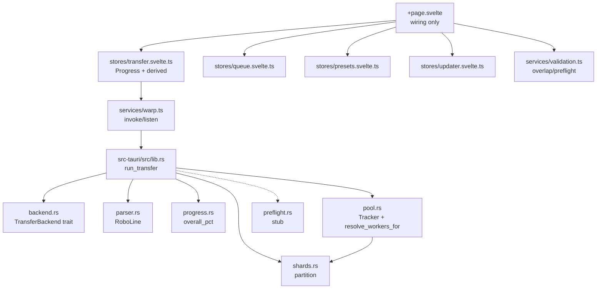

# Warp Architecture — 1.2.4

> One-page view of `docs/WHITEPAPER.md:4` — mermaid + file map. Version 1.2.4



## File map

| Path                                | Role                                                                                        |
| ----------------------------------- | ------------------------------------------------------------------------------------------- |
| `src/routes/+page.svelte`           | 130 lines script, composes `PathCard`/`ModePicker`/`ProgressCard` etc., no business logic   |
| `src/lib/stores/transfer.svelte.ts` | `TransferStore` class `$state`/`$derived` (`canStart`/`overlappingPath`)                    |
| `src/lib/services/validation.ts`    | `getOverlappingPath` etc., pure                                                             |
| `src/lib/services/warp.ts`          | `warpFileOp`/`listenWarpProgress`                                                           |
| `src-tauri/src/lib.rs`              | `run_transfer` → `warp_file_op_sync` / `transfer_parallel`, `TransferControl` + `JobObject` |
| `src-tauri/src/parser.rs`           | `parse_line` tab-column locale robust                                                       |
| `src-tauri/src/progress.rs`         | `overall_pct`/`fmt_speed` parity with `format.ts`                                           |
| `src-tauri/src/backend.rs`          | `TransferBackend` trait (` RobocopyBackend` / `RsyncBackend` stub)                          |
| `src-tauri/src/pool.rs`             | `Tracker`, `resolve_workers_for`, `consume_stream`                                          |
| `src-tauri/src/shards.rs`           | `partition` disjoint shards                                                                 |

## Invariants

- `TransferControl` `kill_all` + `JobObject` `KILL_ON_JOB_CLOSE` — no orphan
- `shards::partition` disjoint + `Tracker` same EWMA as sequential
- `check_overlap` canonicalizes (`lib.rs:848`) to defeat `..\` and junctions
- `warp.log` JSON hashed paths, 5 MB rotate (`lib.rs:310`)

```

```
